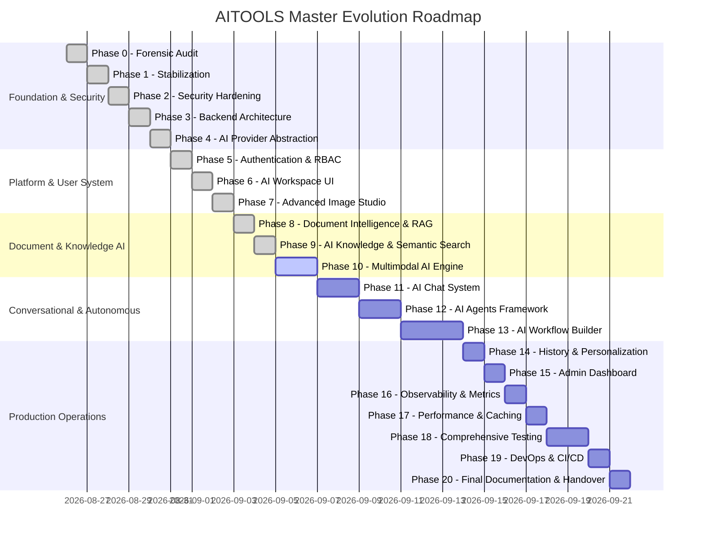

# AITOOLS — Incremental Master Evolution Roadmap (Phase 9 Complete)

This document establishes the structured 20-phase roadmap to evolve AITOOLS into a multi-modal, production-grade AI intelligence workspace.

---

## Evolution Phases & Milestone Status

---

## Detailed Phase Breakdown

### Phase 1: Stabilization (DONE)

- Fixed Hugging Face server proxying, retry and fallback architecture.
- Centralized error handling and clean database degradation.

### Phase 2: Security Hardening (DONE)

- Scrubbed client secrets, implemented CORS allowlist, tiered rate limiting, Helmet, SSRF validator, and upload validation.

### Phase 3: Backend Architecture Refactor (DONE)

- 5-Tier decoupled architecture (`routes/`, `controllers/`, `services/`, `repositories/`, `validators/`, `providers/`).

### Phase 4: AI Provider Abstraction (DONE)

- Provider and model registry with adapter classes for image generation, text summarization, and translation.

### Phase 5: Authentication & User Isolation (DONE)

- JWT access tokens, HTTP-only cookies, bcrypt hashing, and IDOR protection.

### Phase 6: AI Workspace & Generation History (DONE)

- Workspace Dashboard, searchable Generation History with 1-click prompt reuse.

### Phase 7: Advanced Image Studio (DONE)

- Diffusion parameters, aspect ratios, negative prompts, user presets, Prompt Builder.

### Phase 8: Document Intelligence & RAG (DONE)

- PDF/TXT ingestion, deterministic chunking, user-isolated vector store, grounded conversational Q&A, and verifiable source citations.

### Phase 9: AI Knowledge & Semantic Search (DONE)

- Multi-document Knowledge Collections, hybrid semantic + keyword retrieval ($0.70 / 0.30$ weighting), query processor & safe token regexes, ranking engine with human-readable explanations, user-scoped LRU search cache, and glassmorphic Knowledge Engine UI (`/knowledge`).

### Phase 10: Multimodal AI Engine (Next)

- Multi-modal vision and audio processing, cross-modality reasoning.
