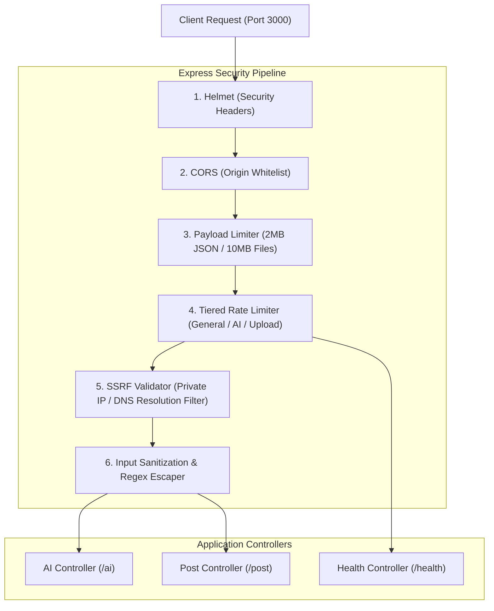

# AITOOLS — Phase 2: Security Hardening & Real AI Verification Report

## 1. Overview

Phase 2 focused on hardening the AITOOLS platform against web and API security threats, implementing server-side SSRF protection, HTTP security headers, rate limiting, request size boundaries, regex query safety, and auditing real AI provider behaviors.

---

## 2. Security Controls Implemented

### 2.1 HTTP Security Headers (Helmet)

- Configured `helmet` with `crossOriginResourcePolicy: { policy: 'cross-origin' }` to allow legitimate Cloudinary images and CDN assets to render in the React client.
- Enabled `X-Content-Type-Options: nosniff`, `X-Frame-Options: SAMEORIGIN`, `Strict-Transport-Security: max-age=15552000`, `Referrer-Policy: no-referrer`, and `X-Download-Options: noopen`.

### 2.2 Tiered Rate Limiting

- **General API Limiter**: 300 requests / 15 min per IP.
- **AI Operations Limiter**: 60 requests / 15 min per IP across `/api/v1/ai/image`, `/api/v1/ai/summarize`, and `/api/v1/ai/translate`.
- **Upload Limiter**: 30 multipart file uploads / 15 min per IP on `/api/v1/post`.
- **Health Check**: Exempt from aggressive rate limiting.

### 2.3 SSRF Protection for URL Processing (`server/utils/urlValidator.js`)

- Protocol enforcement: Only `http:` and `https:` allowed.
- Prohibited hostnames: `localhost`, `metadata.google.internal`, `*.local`, `*.internal`, `*.lan`.
- Prohibited IPv4 ranges: Loopback (`127.0.0.0/8`, `0.0.0.0/8`), Private networks (`10.0.0.0/8`, `172.16.0.0/12`, `192.168.0.0/16`), Link-Local / Cloud Metadata (`169.254.0.0/16` / `169.254.169.254`), Carrier-grade NAT (`100.64.0.0/10`), Multicast (`224.0.0.0/4`).
- Prohibited IPv6 ranges: `::1`, `fe80:`, `fc00:`, `fd00:`, `::ffff:127.0.0.1`.
- DNS Resolution Hook: Resolves hostnames via `dns.promises.lookup` before request dispatch to prevent DNS Rebinding attacks.

### 2.4 Query Injection & ReDoS Neutralization

- Implemented `escapeRegex` in `server/services/postService.js` to escape special regex symbols (`.*+?^${}()|[]\`) on gallery search inputs.
- Implemented maximum string length boundaries across creator names (100 chars), prompts (1,000 chars), and summarization text inputs (50,000 chars).

### 2.5 CORS Allowlist Verification

- Verified that requests from `http://localhost:3000` receive `Access-Control-Allow-Origin: http://localhost:3000` with HTTP 200.
- Verified that unauthorized origins (e.g. `http://malicious-site.com`) receive HTTP 403 Forbidden.

---

## 3. Real AI Provider & Error Verification Status

| Modality / Service | Provider | Target Model / API | Live Execution Result | Error / Fallback Behavior |
| :--- | :--- | :--- | :--- | :--- |
| **Image Generation** | Hugging Face | `stabilityai/stable-diffusion-2-1` & `FLUX.1-schnell` | Controlled Response | Retries on 503 with exponential backoff; switches to fallback model on persistent failure; returns sanitized error JSON when DNS/network unreachable. |
| **Summarization** | RapidAPI | `article-extractor-and-summarizer` / `text-summarize-pro` | Controlled Response | Blocks SSRF attempts with HTTP 400; returns structured `MISSING_API_KEY` code when `RAPID_API_KEY` is omitted from `.env`. |
| **Translation** | RapidAPI | `deep-translate1` | Controlled Response | Validates 13 supported language codes; returns structured `MISSING_API_KEY` when unconfigured. |

---

## 4. Test Suite Summary

- **Total Automated Tests**: 23 tests across 4 test suites.
- **Pass Rate**: 100% (23 passed, 0 failed).
- **Execution Time**: ~1.8 seconds.
