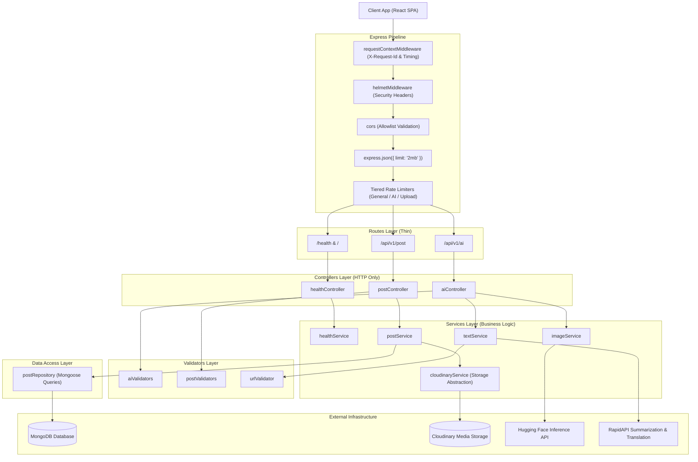

# AITOOLS — Phase 3: Backend Architecture & Service Decoupling Report

## 1. Executive Summary

Phase 3 transformed the AITOOLS Express backend from a monolithic script into a clean, layered, modular architecture. All business logic, third-party storage integrations, database interactions, error handlers, and validators are now decoupled into single-responsibility boundaries.

---

## 2. Final Backend Architecture Diagram



---

## 3. Directory Layout & Module Responsibilities

```text
server/
├── index.js                     # Express app assembly & server lifecycle
├── config/
│   ├── env.js                   # Centralized, validated environment configuration
│   └── database.js              # Non-blocking Mongoose connection & status reporter
├── controllers/
│   ├── aiController.js          # HTTP handler for /api/v1/ai endpoints
│   ├── postController.js        # HTTP handler for /api/v1/post endpoints
│   └── healthController.js      # HTTP handler for /health and /
├── middleware/
│   ├── errorHandler.js          # Centralized error handler with X-Request-Id correlation
│   ├── requestContext.js        # Request ID generation and latency tracking
│   └── security.js              # Helmet headers and tiered rate limiters
├── models/
│   └── post.js                  # Mongoose Post model definition
├── repositories/
│   └── postRepository.js        # Data access layer for Post MongoDB collection
├── routes/
│   ├── aiRoutes.js              # AI route mapping
│   ├── postRoutes.js            # Post route mapping
│   └── healthRoutes.js          # Health and root route mapping
├── services/
│   ├── ai/
│   │   ├── imageService.js      # Hugging Face inference logic & fallback orchestration
│   │   └── textService.js       # RapidAPI text summarization & translation logic
│   ├── health/
│   │   └── healthService.js     # Health evaluation & configuration summary
│   ├── posts/
│   │   └── postService.js       # Post business logic & community orchestration
│   └── storage/
│       └── cloudinaryService.js # Cloudinary storage abstraction & upload handling
├── utils/
│   ├── errors.js                # Typed application errors (AppError, ValidationError, etc.)
│   └── urlValidator.js          # SSRF URL, IP, and DNS rebinding validation
├── validators/
│   ├── aiValidators.js          # Prompt, text length, and language code validators
│   └── postValidators.js        # Creator, prompt, MIME, and query bounds validators
└── tests/
    ├── security.test.js         # SSRF and ReDoS security regression tests
    ├── services.test.js         # AI and post service validation tests
    └── unit/
        └── validators.test.js   # Unit test suite for validators
```

---

## 4. Decoupling Metrics & Improvements

1. **Zero Scattered `process.env`**: All environment variables are parsed and validated inside `server/config/env.js`.
2. **Repository Pattern for MongoDB**: Direct Mongoose calls are removed from services and controllers; `postRepository.js` manages query execution and connection verification.
3. **Storage Service Abstraction**: `cloudinaryService.js` isolates Cloudinary SDK initialization, error translation, and upload result formatting.
4. **Typed Error Hierarchy**: Standardized on `AppError`, `ValidationError`, `ProviderError`, `ConfigurationError`, and `DatabaseError`.
5. **Observability**: `requestContextMiddleware` generates correlation IDs (`req_...`) across every request and response header (`X-Request-Id`).
6. **SDK Vulnerability Resolution**: Upgraded `cloudinary` to `^2.10.1`, bringing server security vulnerabilities to **0**.
7. **Test Suite Expansion**: 34 automated unit and security tests passing in ~2.2s.
