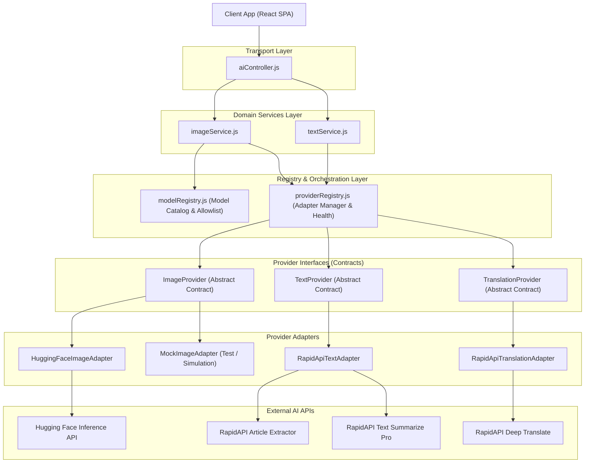

# AITOOLS — Phase 4: AI Provider Abstraction & Model Orchestration Report

## 1. Executive Summary

Phase 4 transformed AITOOLS into a multi-provider AI platform architecture. Provider-specific API endpoints, custom headers, payload structures, retry algorithms, and response formats are completely decoupled from controllers and application domain services. Future providers (OpenAI, Anthropic, Gemini, Stability AI, Replicate, Ollama) can now be integrated by adding a single adapter class and registering it in `providerRegistry`, requiring zero modifications to controllers, routes, or frontend components.

---

## 2. AI Provider Architecture Diagram



---

## 3. Directory Layout & Module Structure

```text
server/providers/
├── index.js                                 # Main export barrel
├── errors/
│   └── providerErrors.js                   # Normalized provider error hierarchy
├── interfaces/
│   ├── ImageProvider.js                    # Abstract Image Generation Interface
│   ├── TextProvider.js                     # Abstract Text & Summarization Interface
│   └── TranslationProvider.js              # Abstract Translation Interface
├── adapters/
│   ├── HuggingFaceImageAdapter.js          # Hugging Face inference logic & cold-start backoff
│   ├── RapidApiTextAdapter.js              # RapidAPI URL extraction & text summarizer adapter
│   ├── RapidApiTranslationAdapter.js       # RapidAPI Deep Translate adapter
│   └── MockImageAdapter.js                 # Extensibility demonstration & testing adapter
└── registry/
    ├── modelRegistry.js                    # Model capabilities, allowlist & metadata catalog
    └── providerRegistry.js                 # Provider singleton registry & health monitoring
```

---

## 4. Key Architectural Capabilities

### 4.1 Model Catalog & Strict Allowlisting

- Client requests for model IDs are verified against `modelRegistry`.
- Invalid or unknown model IDs are intercepted immediately with `ModelNotSupportedError` (HTTP 400).
- Models define capability metadata (`task`, `provider`, `fallbackPriority`, `maxPromptLength`, `isDefault`).

### 4.2 Decoupled Fallback Orchestration

- When the primary image model (`stabilityai/stable-diffusion-2-1`) experiences a transient failure (503/429/504), `imageService.js` automatically orchestrates fallback to the priority-2 model (`black-forest-labs/FLUX.1-schnell`) via the registry without coupling to specific SDKs.

### 4.3 Normalized Provider Errors

- Provider-specific HTTP status codes and error payloads are mapped to `ProviderError`, `ProviderUnavailableError` (503), `ProviderRateLimitError` (429), `ProviderTimeoutError` (504), or `ProviderAuthenticationError` (500).

### 4.4 Dynamic `/api/v1/ai/config`

- Dynamically queries `modelRegistry` and `providerRegistry` to advertise available models, languages, and provider operational statuses without leaking API keys or tokens.

---

## 5. Extensibility: Integrating a Future Provider

Adding a future provider (e.g. OpenAI DALL-E 3) requires only:

1. Create `server/providers/adapters/OpenAIImageAdapter.js` implementing `ImageProvider`.
2. Register it in `server/providers/registry/providerRegistry.js`: `providerRegistry.registerImageProvider('openai', new OpenAIImageAdapter())`.
3. Add the model definition to `server/providers/registry/modelRegistry.js`: `'dall-e-3': { provider: 'openai', ... }`.
4. Add unit contract tests in `server/tests/unit/providers/`.
5. **Zero modifications** required in `aiController.js`, `aiRoutes.js`, or React client code.

---

## 6. Test Suite & Verification Summary

- **Total Automated Tests**: 48 tests across 9 test suites.
- **Pass Rate**: 100% (48 passed, 0 failed, duration: ~3.9s).
- **Client Production Build**: PASSED (0 warnings, 0 errors).
- **Server Dependency Vulnerabilities**: 0.
