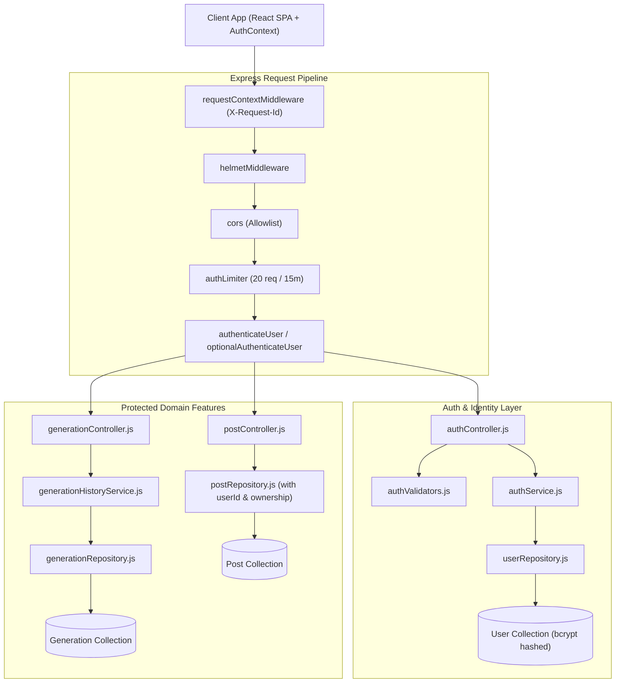

# AITOOLS — Phase 5: Authentication, Authorization & User Identity Report

## 1. Executive Summary

Phase 5 transformed AITOOLS from an anonymous shared utility into a secure multi-user AI platform with strong user identity, role-based authorization, per-user data ownership, generation tracking, and IDOR protection.

---

## 2. Identity & Authorization Architecture Diagram

---

## 3. Implemented Identity Components

### 3.1 User Model (`server/models/user.js`)

- Fields: `name`, `email` (unique index, lowercase, trimmed), `password` (bcrypt 12-round salted hash), `role` (`user` | `admin`), `status` (`active` | `suspended`), timestamps.
- Instance method `toSafeObject()` strictly excludes `password` from all API payloads.

### 3.2 Token & Session Architecture (`server/utils/jwt.js`)

- Access Tokens: Short-lived signed JWTs (15 minutes) containing `{ sub, name, email, role }`.
- Refresh Tokens: 7-day tokens set in secure HttpOnly cookies (`aitools_session`).
- Cookie flags: `httpOnly: true`, `secure: true` (in prod), `sameSite: 'lax'`/`'strict'`, `maxAge: 7d`.

### 3.3 Authorization & Ownership Protection

- Middleware `requireRole('admin')` enforces administrative role boundaries.
- Middleware `optionalAuthenticateUser` enables public generation endpoints to seamlessly track history when authenticated.
- IDOR Protection: Resource deletion (`deletePostService`) strictly checks `post.userId === req.user.id` or `req.user.role === 'admin'`.

### 3.4 Generation History (`server/models/generation.js`)

- Automatically records user AI activity (`image`, `summarize_url`, `summarize_text`, `translate`) with model, prompt, result, and timestamp.
- Protected endpoint `GET /api/v1/generations` returns only the authenticated user's records.

### 3.5 Authentication Rate Limiting

- Dedicated `authLimiter` (20 attempts / 15 min per IP) protects `/api/v1/auth/login`, `/api/v1/auth/register`, and `/api/v1/auth/change-password` against brute-force attacks.

---

## 4. Frontend Authentication Layer

- **AuthContext (`client/src/context/AuthContext.jsx`)**: Global reactive authentication state providing `user`, `isAuthenticated`, `isLoading`, `login`, `register`, `logout`.
- **API Interceptor (`client/src/services/api/client.js`)**: Automatically attaches `Authorization: Bearer <token>` to all outgoing requests and clears stale state on 401.
- **Pages**:
  - `Login.jsx`: Glassmorphic login page.
  - `Register.jsx`: Glassmorphic registration page.
  - `Profile.jsx`: Profile overview, password change, and personal AI generation history.
- **ProtectedRoute (`client/src/components/ProtectedRoute.jsx`)**: Protects private routes (`/profile`) and redirects unauthenticated visitors to `/login`.

---

## 5. Test Suite Summary

- **Total Automated Tests**: 61 tests across 12 test suites.
- **Pass Rate**: 100% (61 passed, 0 failed, duration: ~5.8s).
- **Client Production Build**: PASSED (0 errors, 0 warnings).
- **Server Dependency Vulnerabilities**: 0.
