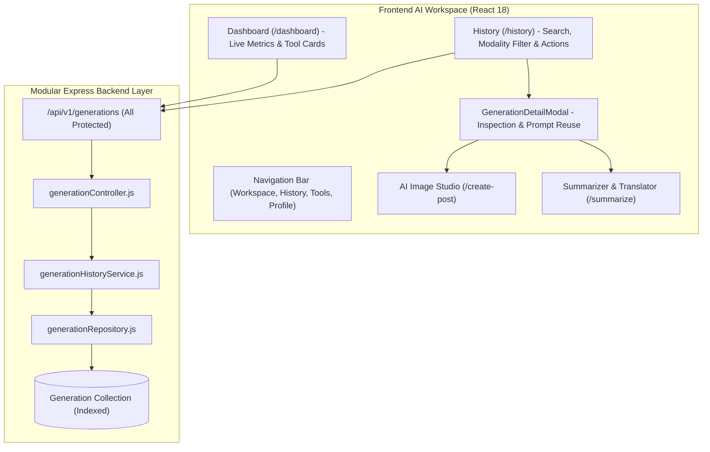

# AITOOLS — Phase 6: AI Workspace & Generation History Report

## 1. Executive Summary

Phase 6 transformed AITOOLS from disconnected individual AI utility pages into a unified, user-centric **AI Workspace**. Authenticated users now have an integrated dashboard with real activity metrics, full search/filterable history, inspection modals, one-click prompt reuse, and IDOR-protected record management.

---

## 2. Workspace Architecture Diagram

---

## 3. Implemented Capabilities

### 3.1 Personal AI Dashboard (`client/src/pages/Dashboard.jsx`)

- Personalized welcome banner.
- Real statistics calculated from database aggregation (`Total Generations`, `Images Generated`, `Summaries`, `Translations`).
- Tool cards launching AI Image Studio, Article Summarizer, and Neural Translator.
- Recent activity list with status pills and quick inspection modal.

### 3.2 Generation History & Management (`client/src/pages/History.jsx`)

- Full server-side search across `prompt`, `model`, and `provider`.
- Modality filter tabs: `All`, `Images`, `URL Summaries`, `Text Summaries`, `Translations`.
- Status filter: `All`, `Completed`, `Failed`.
- Pagination with `page`, `limit`, `totalPages`, `hasNext`, `hasPrevious`.
- Safe deletion with owner verification and admin role overrides.

### 3.3 Generation Detail & Prompt Reuse (`client/src/components/GenerationDetailModal.jsx`)

- Detailed modal displaying full prompt, input, formatted output, model, provider, and execution timestamp.
- Copy-to-clipboard actions for inputs and outputs.
- 1-Click "Reuse in Tool" button populating `CreatePost` or `SummarizeApp` without mutating original historical records.

### 3.4 Backend Generation Repository & Services

- Enhanced schema with `input`, `errorCode`, and compound indexes:
  - `{ userId: 1, createdAt: -1 }`
  - `{ userId: 1, type: 1, createdAt: -1 }`
  - `{ userId: 1, status: 1 }`
- Aggregation query `aggregateUserStats` for zero-overhead dashboard metric computation.
- IDOR protection verifying `userId === req.user.id` or `req.user.role === 'admin'`.

---

## 4. Test Results

- **Total Automated Tests**: 68 tests across 14 test suites.
- **Pass Rate**: 100% (68 passed, 0 failed, duration: ~7.0s).
- **Client Production Build**: PASSED (0 errors, 0 warnings, gzip: 107.58 kB).
- **Server Dependency Vulnerabilities**: 0.
