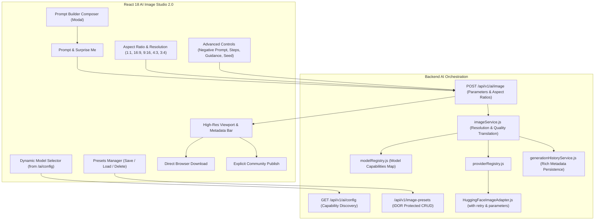

# AITOOLS — Phase 7: Advanced AI Image Studio Report

## 1. Executive Summary

Phase 7 evolved the AI image creation interface into a professional, capability-aware **AI Image Studio**. It integrates fine-grained model capability discovery, aspect ratio translation, diffusion parameters (guidance scale, inference steps, seed, negative prompt), user-owned preset management, a structured prompt builder, full-resolution direct downloads, and explicit community sharing.

---

## 2. Image Studio Architecture Diagram

---

## 3. Implemented Studio Capabilities

### 3.1 Model Capability Discovery (`server/providers/registry/modelRegistry.js`)

- Structured capability mappings for all models:
  - `stabilityai/stable-diffusion-2-1`: Negative prompts, seed, guidance scale (1-20), steps (10-50), 5 aspect ratios, 768px max.
  - `black-forest-labs/FLUX.1-schnell`: 12B transformer, negative prompts disabled, seed, steps (1-8), 1024px native resolution.
  - `stabilityai/stable-diffusion-xl-base-1.0`: Negative prompts, seed, guidance scale (1-20), steps (10-50), 1024px native resolution.
  - `runwayml/stable-diffusion-v1-5`: Classic diffusion, negative prompts, seed, guidance scale, 512px resolution.

### 3.2 Aspect Ratio & Resolution Translation

- Aspect ratios translated into safe, model-bounded dimensions:
  - `1:1 Square` (512x512 / 1024x1024)
  - `16:9 Landscape` (768x432 / 1024x576)
  - `9:16 Portrait` (432x768 / 576x1024)
  - `4:3 Classic` (640x480 / 1024x768)
  - `3:4 Tall` (480x640 / 768x1024)

### 3.3 User-Owned Image Presets (`server/models/imagePreset.js`)

- Full CRUD API (`/api/v1/image-presets`) enabling users to save configurations (`model`, `aspectRatio`, `negativePrompt`, `guidanceScale`, `steps`, `quality`).
- IDOR protected: operations verify `userId === req.user.id`.

### 3.4 Structured Prompt Builder (`client/src/components/PromptBuilderModal.jsx`)

- Interactive modal for composing prompts across Subject, Style, Lighting, Environment, and Camera details.
- Assembles live preview and applies directly to the studio prompt workspace.

### 3.5 Direct Download & Community Sharing

- Direct image download with timestamped filenames (`handleDownload`).
- Explicit community sharing with author name and Cloudinary persistence.

---

## 4. Test Results

- **Total Automated Tests**: 81 tests across 17 test suites.
- **Pass Rate**: 100% (81 passed, 0 failed, duration: ~9.1s).
- **Client Production Build**: PASSED (0 errors, 0 warnings, gzip: 114.25 kB).
- **Server Dependency Vulnerabilities**: 0.
