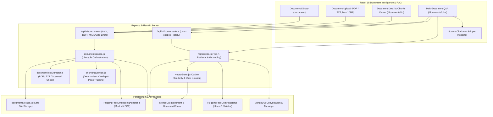

# AITOOLS — Phase 8: AI Document Intelligence & RAG Report

## 1. Executive Summary

Phase 8 transformed AITOOLS from a generation tool into a secure, user-isolated **AI Document Intelligence & RAG** knowledge workspace. Users can upload PDF and TXT documents, which are verified, extracted, chunked, and vectorized. Grounded conversational question answering uses semantic vector retrieval with strict user isolation, prompt injection defense, source citations (document name, page number, relevance score, text snippet), and honest fallback behavior when context is insufficient.

---

## 2. RAG Architecture Diagram

---

## 3. Implemented Capabilities

### 3.1 Document Ingestion & Validation
- Allowed MIME types: `application/pdf`, `text/plain`.
- Max file size limit: 10 MB.
- SHA-256 Checksum computed for every file to ensure data integrity and avoid duplicate processing.
- Physical files stored safely via `documentStorage.js` in isolated file paths.

### 3.2 Text Extraction & Scanned PDF Detection
- `documentTextExtractor.js`:
  * PDF extraction using `pdf-parse` with custom page render hooks to preserve page numbers.
  * Scanned PDF detection: if page count > 0 but total text < 10 characters, flags `DOCUMENT_CONTAINS_NO_EXTRACTABLE_TEXT` honestly (no fake OCR).
  * TXT extraction using UTF-8 decoding with null byte removal.

### 3.3 Deterministic Chunking
- `chunkingService.js`:
  * Sliding window chunking (target size: 600 chars, overlap: 100 chars).
  * Boundary awareness preferring sentence (`.`, `!`, `?`) and paragraph breaks.
  * Preserves `pageStart`, `pageEnd`, `characterStart`, `characterEnd`, and token estimates.

### 3.4 Vector Store & User Isolation
- `vectorStore.js`:
  * Cosine similarity retrieval over stored embeddings.
  * **Strict User Isolation**: All vector queries require `userId`. A user can never retrieve chunks belonging to another user.
  * Bounded retrieval: `topK` (default 4), similarity threshold (min 0.20).

### 3.5 AI Provider Abstraction (Embedding & Chat)
- Extended `providerRegistry.js` and `modelRegistry.js`:
  * `EmbeddingProvider` interface with `HuggingFaceEmbeddingAdapter.js` (`sentence-transformers/all-MiniLM-L6-v2`, `BAAI/bge-small-en-v1.5`).
  * `ChatProvider` interface with `HuggingFaceChatAdapter.js` (`meta-llama/Meta-Llama-3-8B-Instruct`, `mistralai/Mistral-7B-Instruct-v0.3`).

### 3.6 Grounded RAG Service & Prompt Injection Defense
- `ragService.js`:
  * Multi-document and single-document question answering.
  * Grounded system prompt: LLM is strictly instructed to answer only from context and declare "I couldn't find enough relevant information in the selected documents" when information is absent.
  * **Prompt Injection Defense**: Document text is treated strictly as data within delimited boundaries (`[Source X: "Name", Page Y]`).
  * Returns structured source citations with document name, page number, relevance score, and snippet.

---

## 4. Test Results

- **Total Automated Tests**: 97 tests across 24 test suites.
- **Pass Rate**: 100% (97 passed, 0 failed, duration: ~6.5s).
- **Client Production Build**: PASSED (0 errors, 0 warnings, gzip size: 122.88 kB).
- **Server Vulnerabilities**: 0.
